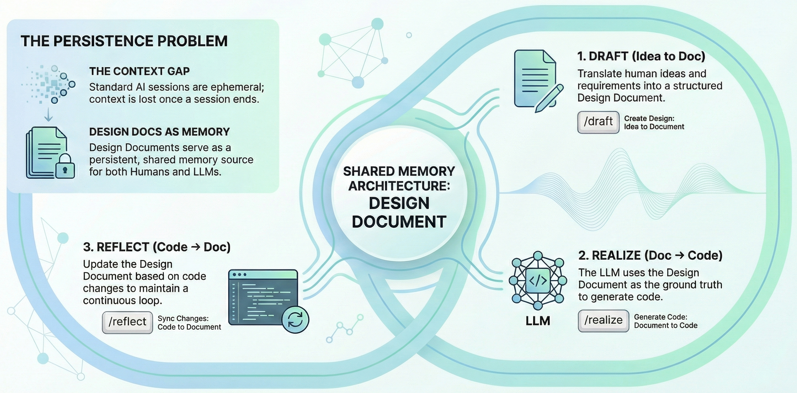

# ✨ Design-Doc Loop (DDL)

> Human and LLM share design across sessions.



---

## 🎯 The Problem

- Sessions end
- Context is lost
- Previous discussions are forgotten

## 💡 The Solution

Use Design Documents as shared memory.

```
Human ←→ Design Document ←→ LLM
                ↓
              Code
```

## 🔄 The Loop

```
      Draft
        ↓
Design Document ⇄ Code
   (Realize ↓  ↑ Reflect)
```

| Phase | Flow |
|-------|------|
| 📝 **Draft** | Idea → Design Document |
| ⚡ **Realize** | Design Document → Code |
| 🪞 **Reflect** | Code → Design Document |

Realize and Reflect are inverse functions.

---

## 📚 Documentation

- [English](./docs/en/design_philosophy.md)
- [日本語](./docs/ja/design_philosophy.md)

## 🛠️ Commands (Optional)

### Claude Code

```bash
cp examples/claude-commands/*.md your-project/.claude/commands/
```

| Command | Action |
|---------|--------|
| `/draft` | Idea → Design Document |
| `/realize` | Design Document → Code |
| `/reflect` | Code → Design Document |

### OpenAI Codex

```bash
cp -r examples/codex-skills/* your-project/.codex/skills/
```

| Skill | Action |
|-------|--------|
| `$draft` | Idea → Design Document |
| `$realize` | Design Document → Code |
| `$reflect` | Code → Design Document |

---

## 📄 License

[CC BY 4.0](./LICENSE) with publishing restriction
